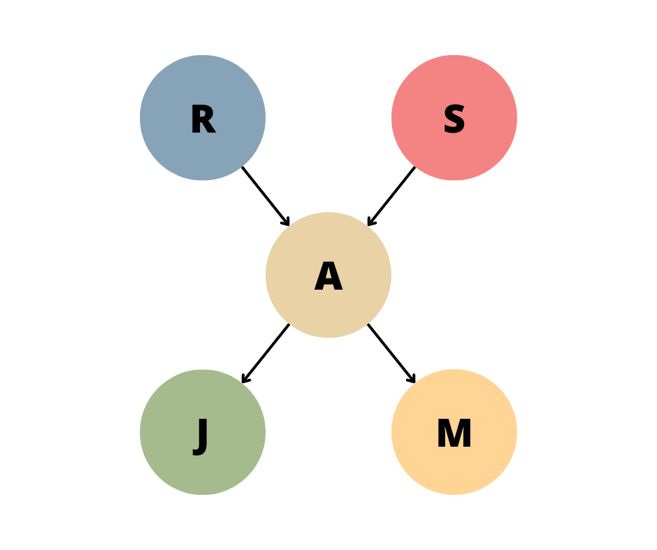
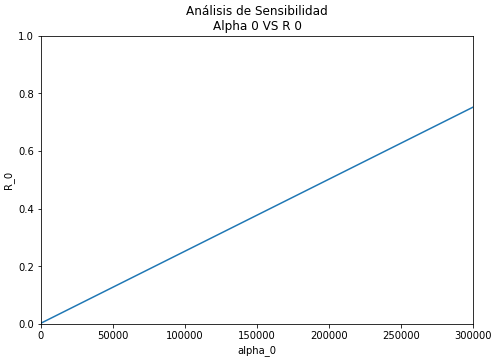
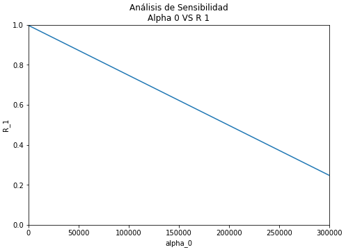

# Taller 4

### Aprendizaje en Redes Bayesianas

##### Analítica Computacional para la Toma de Decisiones

---

|     Nombres      |      Apellidos       |     Login     |  Codigo   |
| :--------------: | :------------------: | :-----------: | :-------: |
|     Santiago     | Gonzalez Montealegre | s.gonzalez35  | 202012274 |
| Juliana Carolina |  Cardenas Barragan   | jc.cardenasb1 | 202011683 |

---

---

## Generando Datos y Estimando Parámetros

---

### 4.

Emplee el módulo de ajuste de pgmpy para ajustar algunas CPDs del nuevo modelo.

<br>

**R/**

Usando el modelo anteriormente usado y sus parámetros que se observa de la siguiente forma:



Se generaron 100,000 números aleatorios que siguen la distribución definida por el grafo.

A partir de esto se crea un nuevo modelo con la misma estructura, pero sin definir los parámetros (probabilidades).

Ahora queremos a partir de los 100,000 datos generados que el nuevo grafo se ajuste a la distribución de estos datos.

Usamos el siguiente código:

```py
from pgmpy.estimators import MaximumLikelihoodEstimator

# Create the model to adjust the CPD's
emv = MaximumLikelihoodEstimator(model=mod_fit_mv, data=samples)

# CPD de R
cpdem_r = emv.estimate_cpd(node='R')
print(cpdem_r)
# CPD de S
cpdem_s = emv.estimate_cpd(node='S')
print(cpdem_s)
# CPD de A
cpdem_a = emv.estimate_cpd(node='A')
print(cpdem_a)
```

- **R**

Distribución estimada a partir de los datos:

|  R   |  P(R)   |
| :--: | :-----: |
| R(0) | 0.01005 |
| R(1) | 0.98995 |

Comparamos con la distribución original teórica:

|  R  | P(R) |
| :-: | :--: |
|  V  | 0.01 |
|  F  | 0.99 |

<br>

- **S**

Distribución estimada a partir de los datos:

|  S   |  P(S)   |
| :--: | :-----: |
| S(0) | 0.02009 |
| S(1) | 0.97991 |

Comparamos con la distribución original teórica:

|  S  | P(S) |
| :-: | :--: |
|  V  | 0.02 |
|  F  | 0.98 |

Se puede observar que son bastante similares.

<br>

- **A**

Distribución estimada a partir de los datos:

| P(A &#124; R, S |   R   |   R(0)   |        R(0)         |        R(1)        |         R(1)          |
| :-------------: | :---: | :------: | :-----------------: | :----------------: | :-------------------: |
|      **A**      | **S** | **S(0)** |      **S(1)**       |      **S(0)**      |       **S(1)**        |
|      A(0)       |       |  0.9375  | 0.9373104145601617  | 0.2814851981936779 | 0.0008762705923589204 |
|      A(1)       |       |  0.0625  | 0.06268958543983821 | 0.7185148018063221 |   0.999123729407641   |

Comparamos con la distribución original teórica:

| P ( A &#124; R , S) |   R   |   V   |   V   |   F   |   F   |
| :-----------------: | :---: | :---: | :---: | :---: | :---: |
|        **A**        | **S** | **V** | **F** | **V** | **F** |
|          V          |       | 0.95  | 0.94  | 0.29  | 0.001 |
|          F          |       | 0.05  | 0.06  | 0.71  | 0.999 |

Se puede observar que son bastante similares.

---

### 5.

Emplee el método fit para ajustar todas las CPDs al tiempo y explore el resultado.

```py
# Adjust the CPD's of all variables to the Data
mod_fit_mv.fit(
    data=samples,
    estimator=MaximumLikelihoodEstimator
)

for i in mod_fit_mv.nodes():
    print(i)
    print(mod_fit_mv.get_cpds(i))
```

<br>

**R/**

Los resultados de las distribuciones estimades a partir de la muestra son los siguientes:

- **R**

|  R   |  P(R)   |
| :--: | :-----: |
| R(0) | 0.01005 |
| R(1) | 0.98995 |

- **S**

|  S   |  P(S)   |
| :--: | :-----: |
| S(0) | 0.02009 |
| S(1) | 0.97991 |

- **A**

| P(A &#124; R, S |   R   |   R(0)   |        R(0)         |        R(1)        |         R(1)          |
| :-------------: | :---: | :------: | :-----------------: | :----------------: | :-------------------: |
|      **A**      | **S** | **S(0)** |      **S(1)**       |      **S(0)**      |       **S(1)**        |
|      A(0)       |       |  0.9375  | 0.9373104145601617  | 0.2814851981936779 | 0.0008762705923589204 |
|      A(1)       |       |  0.0625  | 0.06268958543983821 | 0.7185148018063221 |   0.999123729407641   |

- **J**

|  A   |        A(0)         |         A(1)         |
| :--: | :-----------------: | :------------------: |
| J(0) | 0.9023929471032746  | 0.050349550867780354 |
| J(1) | 0.09760705289672544 |  0.9496504491322196  |

- **M**

|  A   |        A(0)         |         A(1)         |
| :--: | :-----------------: | :------------------: |
| M(0) | 0.7015113350125944  | 0.009927651099459416 |
| M(1) | 0.29848866498740556 |  0.9900723489005406  |

---

### 7.

#### 7.1

Realice nuevamente la estimación del modelo usando un prior.

```py
cpdby_r = eby.estimate_cpd(node='R',
                           prior_type='dirichlet',
                           pseudo_counts=[[100000], [200000]])
print(cpdby_r)
```

**R/**

Se obtuvieron los siguientes resultados:

##### Prior + Datos

Datos: 400,000 = 100,000 reales + 300,000 virtuales

|  R   |   P(R)   |
| :--: | :------: |
| R(0) | 0.252512 |
| R(1) | 0.747487 |

Recordemos los resultados obtenidos a partir únicamente de los datos

##### Datos

Datos: 100,000 reales

|  R   |  P(R)   |
| :--: | :-----: |
| R(0) | 0.01005 |
| R(1) | 0.98995 |

<br>

#### 7.2

Modifique los valores de pseudocounts e interprete los resultados.

<br>

**R/**

Basado en el supuesto de que el total de `pseudo_counts` es constante (300 mil), se hizo un análisis de sensibilidad de `alpha_0`.
Definimos

$$ alpha_1 = pseudo\ counts - alpha_0 $$
$$ alpha_1 = 300,000 - alpha_0 $$

<br>

Se obtiene la siguiente gráfica:



Podemos ver que el cambio es lineal. Además, así `alpha_0 = pseudo_counts`, podemos ver que la $P(R=0)=0.752513$, a pesar de que en nuestro _Prior_ la probabilidad sea $P(R=0)=1$. Esto se debe a los datos reales que tenemos.

Si el cambio en $P(R=0)$ es lineal, entonces $P(R=1)$ también cambiará linealmente pero con la pendiente negativa. Esto se observa en la siguiente gráfica:



Algunas de las muestras más importantes se observan a continuación:

| Alpha 0 | Alpha 1 |   R(0)   |   R(1)   |
| :-----: | :-----: | :------: | :------: |
|    0    | 300000  | 0.002512 | 0.997487 |
| 150000  | 150000  | 0.377512 | 0.622487 |
| 300000  |    0    | 0.752513 | 0.247487 |

La distribución original a partir de los datos:

|  R   |  P(R)   |
| :--: | :-----: |
| R(0) | 0.01005 |
| R(1) | 0.98995 |

Se puede observar el efecto de implementar _'datos virtuales'_ dado que modificamos las probabilidades teniendo en cuenta nuestro _Prior_.

---

---

## Ahora con Otra Red y Datos

---

Realice el proceso de estimación de la red en la gráfica, empleando los datos del archivo adjunto. Estudie los parámetros obtenidos en su reporte.

<br>

**R/**

Se crea la estructura de la red deseada, por medio del siguiente código:

```py
# Create the model with the graph
model = BayesianNetwork(
    [("asia", "tub"),
     ("tub", "either"),
     ("smoke", "lung"),
     ("lung", "either"),
     ("smoke", "bronc"),
     ("either", "xray"),
     ("either", "dysp"),
     ("bronc", "dysp")]
)
```

<br>

Leemos los datos del archivo

```py
# Read the Data
df = pd.read_csv("Data/data_asia.csv")
# Drop not useful column
df.drop('Unnamed: 0', axis=1, inplace=True)
```

El dataframe con los datos leídos se ve de la siguiente forma:

| asia | tub | smoke | lung | bronc | either | xray | dysp |
| :--: | :-: | :---: | :--: | :---: | :----: | :--: | :--: |
|  no  | no  |  no   |  no  |  yes  |   no   |  no  |  no  |
|  no  | no  |  no   | yes  |  no   |  yes   | yes  |  no  |
|  no  | no  |  no   |  no  |  no   |   no   |  no  |  no  |
|  no  | no  |  yes  |  no  |  yes  |   no   |  no  | yes  |
|  no  | no  |  yes  |  no  |  no   |   no   |  no  |  no  |

Podemos ver que todas las variables son categóricas, particularmente binarias.

<br>

Ahora, ajustamos el modelo calculando las distribuciones condicionales de probabilidad basados en los datos de la muestra. Esto se realiza por medio del siguiente código:

```py
# Fit the model to the data
model.fit(
    data=df,
    estimator=MaximumLikelihoodEstimator
)

for i in model.nodes():
    print(i)
    print(model.get_cpds(i))
```

Los resultados y las distribuciones condicionales de probabilidad para cada uno de los nodos del grafo son:

#### - Asia

Este nodo representa si una persona visitó recientemente Asia.

|   asia    | P( asia ) |
| :-------: | :-------: |
| asia(no)  |  0.99057  |
| asia(yes) |  0.00943  |

El nodo `asia` no tiene padres por lo que no está condicionado. Podemos observar que hay mucha más probabilidad de que una persona no haya visitado Asia. Esto se debe a que la muestra fue hecha en personas que en su mayoría no habían viajado a Asia.

#### - Tub

Este nodo representa si una persona tiene tuberculosis.

| P( tub &#124; asia ) |       asia(no)       | asia(yes)           |
| :------------------: | :------------------: | ------------------- |
|       tub(no)        |  0.9895918511564049  | 0.9448568398727466  |
|       tub(yes)       | 0.010408148843595103 | 0.05514316012725345 |

El nodo `tub` esta condicionado por el nodo `asia`. Podemos observar que si una persona visitó recientemente Asia aumenta en un 4% la probabilidad de tener tuberculosis respecto a si no lo hubiera visitado.

#### - Smoke

Este nodo representa si una persona fuma.

|   smoke    | P( smoke ) |
| :--------: | :--------: |
| smoke(no)  |  0.50054   |
| smoke(yes) |  0.49946   |

El nodo `smoke` no tiene padres, por lo que no está condicionado. Podemos observar que hay es casi equiprobable que una persona fume o no. Esto se debe a que posiblemente la muestra fue balanceada, es decir, la mitad de las personas fumaba.

#### - Lung

Este nodo representa si una persona tiene cáncer de pulmón.

| P( lung &#124; smoke ) |      smoke(no)       |     smoke(yes)      |
| :--------------------: | :------------------: | :-----------------: |
|        lung(no)        |  0.9905701842010628  | 0.8993512994033557  |
|       lung(yes)        | 0.009429815798937148 | 0.10064870059664438 |

El nodo `lung` esta condicionado por el nodo `smoke`. Podemos observar que si una persona fuma aumenta casi en un 10% la probabilidad de tener cáncer de pulmón respecto a si no fumara. Estos resultados tienen sentido ya que hay evidencia que fumar está directamente relacionado con el desarrollo de cáncer de pulmón, sin embargo, el aumento en la probabilidad no es tan grande como se imaginaria, posiblemente gran parte de las personas en la muestra eran jóvenes por lo que no han desarrollado el cáncer.

#### - Either

Este nodo representa si una persona tiene cáncer de pulmón o tuberculosis.

| P(either &#124; lung, tub) |  lung   | lung(no)    | lung(no)     | lung(yes)   | lung(yes)    |
| :------------------------: | :-----: | ----------- | ------------ | ----------- | ------------ |
|         **either**         | **tub** | **tub(no)** | **tub(yes)** | **tub(no)** | **tub(yes)** |
|         either(no)         |         | 1.0         | 0.0          | 0.0         | 0.0          |
|        either(yes)         |         | 0.0         | 1.0          | 1.0         | 1.0          |

El nodo `either` esta condicionado tanto por el nodo `lung` como por el nodo `tub`. Podemos observar que esta es una variable binaria que toma el valor _si_ si la persona tiene alguna de las enfermedades (cáncer de pulmón y tuberculosis), de lo contrario toma el valor _no_.

#### - Bronc

Este nodo representa si una persona tiene bronquitis.

| P( bronc &#124; smoke ) |      smoke(no)      | smoke(yes)          |
| :---------------------: | :-----------------: | ------------------- |
|        bronc(no)        | 0.7000039956846605  | 0.40153365634885674 |
|       bronc(yes)        | 0.29999600431533946 | 0.5984663436511433  |

El nodo `bronc` esta condicionado por el nodo `smoke`. Podemos observar que si una persona fuma aumenta considerablemente (30%) la probabilidad de tener tuberculosis respecto a si no fumara. Estos resultados tienen sentido ya que hay evidencia que fumar está directamente relacionado con el desarrollo de bronquitis.

#### - Xray

Este nodo representa si una persona toma un examen de rayos x.

| P( xray &#124; either ) |      either(no)      | either(yes)         |
| :---------------------: | :------------------: | ------------------- |
|        xray(no)         |  0.9506402644500787  | 0.01962287291123716 |
|        xray(yes)        | 0.049359735549921374 | 0.9803771270887628  |

El nodo `xray` esta condicionado por el nodo `either`. Podemos observar que si una persona tiene cáncer de pulmón o tuberculosis aumenta considerablemente la probabilidad de tomar un examen de rayos x respecto a si no tuviera ninguna de las enfermedades. Esto tiene sentido, ya que si no tiene ninguna enfermedad no hay necesidad de realizar el examen.

#### - Dysp

Este nodo representa si una persona sufre de dificultad para respirar (dyspnoea).

| P( dysp &#124; bronc, either ) |   bronc    | bronc(no)           | bronc(no)           | bronc(yes)         | bronc(yes)          |
| :----------------------------: | :--------: | ------------------- | ------------------- | ------------------ | ------------------- |
|            **dysp**            | **either** | **either(no)**      | **either(yes)**     | **either(no)**     | **either(yes)**     |
|            dysp(no)            |            | 0.8995302463809798  | 0.28692988427501703 | 0.200329122501331  | 0.09483960948396095 |
|           dysp(yes)            |            | 0.10046975361902023 | 0.713070115724983   | 0.7996708774986689 | 0.905160390516039   |

El nodo `dysp` esta condicionado tanto por el nodo `bronc` como por el nodo `either`. Podemos observar que si una persona no posee ni bronquitis ni sufre de tuberculosis o cáncer de pulmón la probabilidad de sufrir de dificultad para respirar es baja. Sin embargo, en caso de tener bronquitis o sufrir ya sea de tuberculosis o cáncer de pulmón aumenta hasta en un 70% la probabilidad de sufrir dificultad para respirar. Finalmente, si tiene bronquitis y también tiene tuberculosis o cáncer de pulmón la probabilidad de tener dificultad para respirar llega a 0.9. Todos estos resultados tienen sentido ya que son enfermedades que afectan directamente la capacidad pulmonar de la persona y causando con mayor probabilidad dificultad para respirar.
